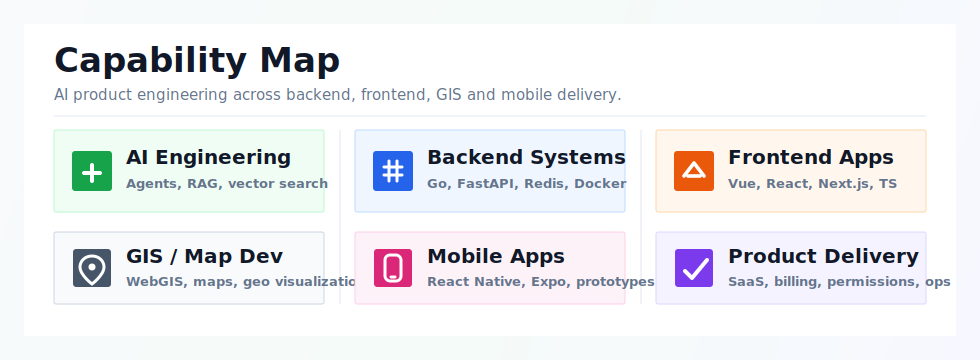
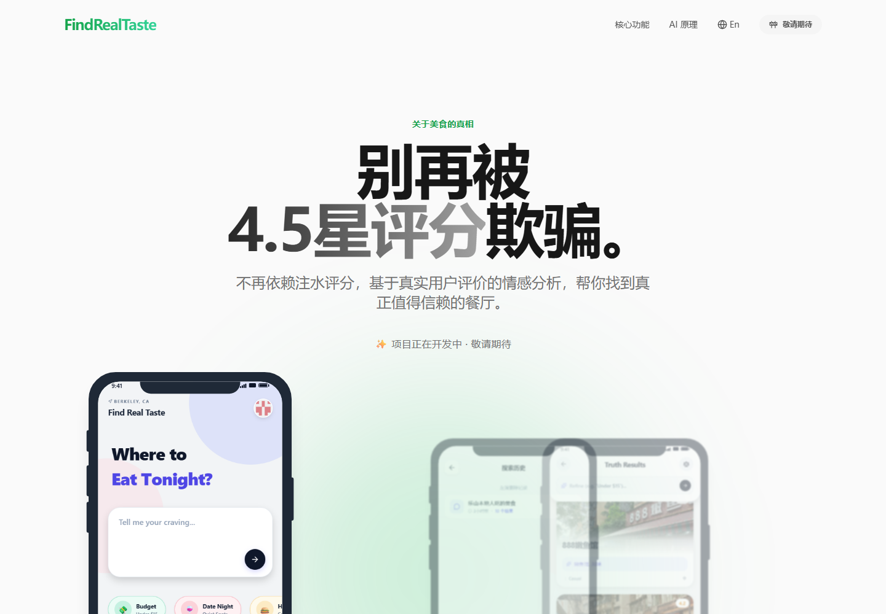
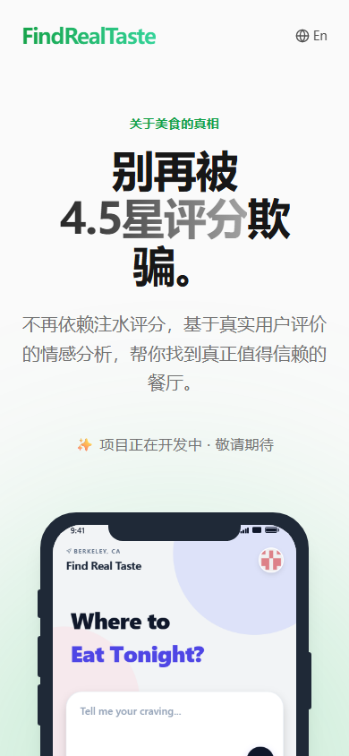

# Hi, I'm Gou Jiayun

I'm a full-stack developer and graduate student at Chengdu University of Technology, working on AI SaaS products, LLM agent systems, RAG applications and data-driven backend platforms.

My recent work focuses on turning AI capabilities into reliable product systems: routing, streaming, permissions, billing, retrieval, observability and frontend workflows.

## What I Build

## Tech Stack

## Featured Work

| Project | Focus | Stack |
| --- | --- | --- |
| AnyFast AI API Gateway | Multi-tenant AI API proxy, dynamic provider routing, RBAC, realtime metrics | Go, Gin, GORM, Redis, PostgreSQL, Casbin |
| AnyFast AD | AI advertising creative agent platform, ReAct loop, streaming events, RAG knowledge base | Next.js, TypeScript, Redis Stream, BullMQ, pgvector |
| [FindRealTaste](https://github.com/MARYCOMPLEX/food_agent) | AI food discovery app that filters noisy social recommendations with LLM workflows | React Native, FastAPI, LangChain, Redis, PostgreSQL |
| EngineerSurveyGPT | Campus AI question-answering system for engineering surveying | Python, LangGraph, LangChain, RAG, Pydantic |

## FindRealTaste Preview

  
  

## Engineering Highlights

- Built dynamic AI provider routing with Bayesian scoring, P95 latency normalization and circuit breaker isolation.
- Designed Redis Stream + SSE event pipelines for long-running agent tasks with reconnect recovery.
- Implemented multi-tenant permission models covering API authorization, row-level scope and field-level masking.
- Built hybrid retrieval pipelines with vector search, full-text search, trigram matching and RRF rank fusion.
- Developed AI-assisted workflows with Claude Code, Codex, Cursor and GitHub Copilot to improve delivery speed and code quality.
- Experienced with Vue ecosystem development, frontend admin systems and map/GIS interaction scenarios.

## Current Direction

I'm interested in practical AI products: systems that combine LLM reasoning with strong engineering foundations, including permissions, billing, streaming, retrieval, evaluation and production reliability.

## Connect

