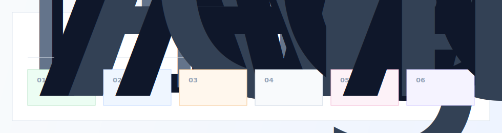
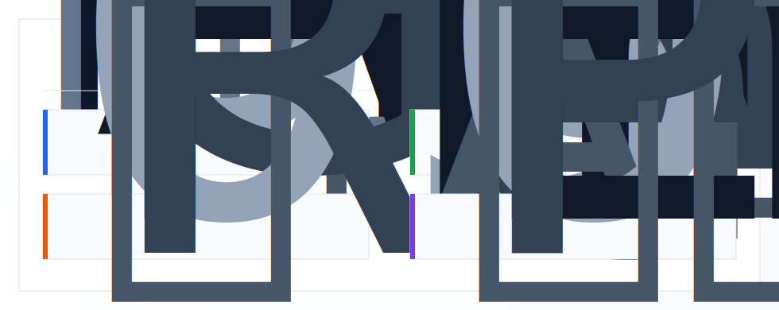

# 你好，我是 marycomplex

[English](./README.md) | [简体中文](./README.zh-CN.md)

我是一名全栈开发者，也是成都理工大学硕士研究生，主要关注 AI SaaS、LLM Agent、RAG 应用和数据驱动的后端系统。

我更关注把 AI 能力做成真正可用的产品系统：路由、流式输出、权限、计费、检索、评估、运维和前端工作流。

## 我在构建什么

## 技术栈

## 代表项目

[FindRealTaste 仓库](https://github.com/MARYCOMPLEX/food_agent) · [在线预览](https://marycomplex.github.io/display-pages/)

## FindRealTaste 预览

  
  

## 工程亮点

- 设计基于贝叶斯评分、P95 延迟归一化和熔断隔离的 AI 供应商动态路由。
- 构建 Redis Stream + SSE 事件通道，支持长任务断线重连和事件恢复。
- 实现覆盖 API 鉴权、行级数据范围和字段级脱敏的多租户权限模型。
- 构建向量检索、全文检索、trigram 模糊匹配和 RRF 融合的混合检索管道。
- 熟练使用 Claude Code、Codex、Cursor 和 GitHub Copilot，将 AI 融入研发工作流。
- 具备 Vue 全家桶、前端管理台、地图/GIS 交互和移动端产品开发经验。

## 当前方向

我关注实用型 AI 产品：把 LLM 推理能力和可靠的工程系统结合起来，包括权限、计费、流式交互、检索、评估与生产可用性。

## 联系方式

